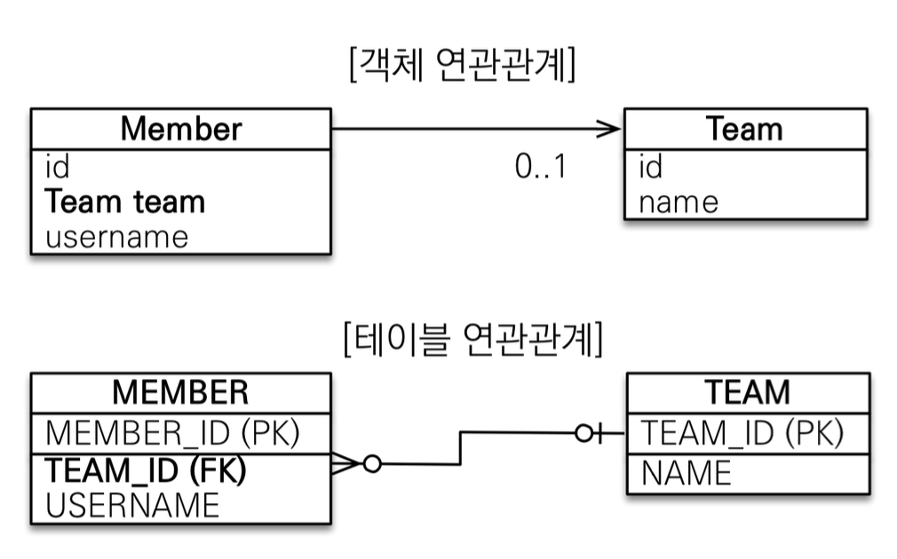

# 연관관계 매핑

## Index

- [연관관계 매핑](#연관관계-매핑)
  - [Index](#index)
  - [단방향 연관관계](#단방향-연관관계)
    - [객체의 참조와 테이블의 외래키를 매핑](#객체의-참조와-테이블의-외래키를-매핑)
    - [용어정리](#용어정리)
      - [방향(Direction)](#방향direction)
      - [다중성(Multiplicity)](#다중성multiplicity)
      - [연관관계의 주인(Owner)](#연관관계의-주인owner)
    - [단방향 예시](#단방향-예시)
  - [양방향 연관관계](#양방향-연관관계)
    - [양방향 연관관계와 연관관계의 주인 1 - 기본](#양방향-연관관계와-연관관계의-주인-1---기본)
      - [객체와 테이블이 관계를 맺는 차이점](#객체와-테이블이-관계를-맺는-차이점)
      - [mappedBy를 사용해서 변수를 지정하는 이유](#mappedby를-사용해서-변수를-지정하는-이유)
      - [연관관계의 주인](#연관관계의-주인)
      - [주인을 정하는 기준](#주인을-정하는-기준)
    - [양방향 연관관계와 연관관계의 주인2 - 주의점, 정리](#양방향-연관관계와-연관관계의-주인2---주의점-정리)
      - [양방향 매핑시 가장 많이 하는 실수](#양방향-매핑시-가장-많이-하는-실수)
      - [양방향 매핑의 추가에 대한 조건](#양방향-매핑의-추가에-대한-조건)

---

## 단방향 연관관계

### 객체의 참조와 테이블의 외래키를 매핑

> 객체는 .getId등으로 끝나게 되지만 테이블은 관계를 맺기 위해서 무조건 적으로 외래키를 활용해야한다.

### 용어정리

#### 방향(Direction)

- 단방향
- 양방향

#### 다중성(Multiplicity)

> `@ManyToOne`, `@OneToMany`, `@ManyToMany` Annotation 활용

- 다대일(N:1)
- 일대다(1:N)
- 다대다(N:M)

#### 연관관계의 주인(Owner)

> 객체 양방향 연관관계는 관리의 필요

### 단방향 예시

> 일방적으로 참조만 하는 관계로 다음과 같은 구상도가 이뤄지게 된다.



```
@Entity
public class Member {

  @Id
  @Column(name="MEMBER_ID")
  private Long id;

  @ManyToOne
  @JoinColumn(name="TEAM_ID")
  private Team team;

  privage String username;
}

@Entity
public class Team {
  @Id
  @GeneratedValue
  @Column(name="TEAM_ID")
  private Long id;

  private String name;
}
```

---

## 양방향 연관관계

> DB테이블은 애초애 외래키를 기반으로 데이터를 가져오면 되다보니 방향성이 따로 존재하지 않는다. 하지만 객체의 경우에는 선언을 해주지않으면 방향성이 존재하지 않아 참조가 불가능하다.

### 양방향 연관관계와 연관관계의 주인 1 - 기본

> `mappedBy` 옵션을 활용해야 하며, 반대변객체에 선언된 **변수명**을 기록해야 한다.

```
@Entity
public class Member {

  @Id
  @Column(name="MEMBER_ID")
  private Long id;

  @ManyToOne
  @JoinColumn(name="TEAM_ID")
  private Team team;

  privage String username;
}

@Entity
public class Team {
  @Id
  @GeneratedValue
  @Column(name="TEAM_ID")
  private Long id;

  private String name;

  @OneToMany(mappedBy="team")
  private List<Member> members = new ArrayList<>();
}
```

#### 객체와 테이블이 관계를 맺는 차이점

- 테이블
  - 테이블의 경우에는 단한개의 방향이 존재하며 해당 존재는 외래키를 통한 것이다.
  - 외래키를 통해서 양측모두에게서 조회가 가능함.
- 객체
  - 객체의 경우에는 단방향 두개가 합쳐져 양방향이 되는 것으로 서로 참조를 해주지 않으면 양쪽 모두에서 양방향 조회는 불가능 하다.

#### mappedBy를 사용해서 변수를 지정하는 이유

> DB입장에서는 결국 외래키에 대한 업데이트만 이뤄지면 되기 때문에 의미가 없다 하지만 객체의 입장에서 볼떄는 문제가 달라지게 되는데 객체 입장에서는 양방향이 되면 정보의 수정이 이뤄질 때 어디를 봐야 하는지를 구분이 불가능하다는 점이 발생한다.
> 즉 양측 모두의 업데이트가 이론적으로는 맞게되는것, 그로인한 문제를 막기 위해 **둘 중 하나의 외래키로 관리**를 하기 위해서 mappedBy로 지정을 하게 됨 해당 문제를 **연관관계의 주인**이라 칭함.

#### 연관관계의 주인

- 객체의 두 관계중 하나의 연관관계만 주인으로 지정한다.
- 연관관계의 주인만이 외래 키를 관리한다 (등록, 수정)
- 주인이 아닌쪽은 읽기만 가능하다.
- 주인은 `mappedBy`속성을 사용하지 않는다.
- 주인이 아니면 `mappedBy`속성으로 주인을 지정한다.

#### 주인을 정하는 기준

> 권장이지 무조건은 아니다.

- **외래키가 있는 곳을 주인으로 정한다.**

### 양방향 연관관계와 연관관계의 주인2 - 주의점, 정리

#### 양방향 매핑시 가장 많이 하는 실수

- 연관관계의 주인에 값을 입력하지 않는 것
  - mappedBy로 연관관계를 걸은 컬럼은 적용이 되지 않는다.
  - 가장 좋은건 객체지향적으로 생각하면 양쪽 모두에 값을 주는게 가장 이상적이긴 하다.
    - 가장 이상적인 이유는 만약 객체에 값을 주지 않은 상태에서 작업이 종료되지않고 추가로 진행하면서 flush, clear가 되지 않으면 1차캐시에 값이 남아있게 되는데 빈객체로 남아있기 떄문에 값이 없는 문제가 발생함.
    - 양쪽에 모두 넣는 메소드를 만드는쪽으로 관리하면 편함.
    - toString, lombok, JSON생성 라이브러리에 대해서 조심. 양측의 .toString()을 루프로 무한 호출하기 떄문
    - Controller에서는 Entity를 바로 반환하지 말고 DTO로 변환해서 반환하자. Entity는 수정이 생길수도 있는데 그걸 그대로 반환하면 일단 1차적인문제는 API의 스펙이 변경되는것...

#### 양방향 매핑의 추가에 대한 조건

- 기본 설계는 단방향 매핑으로 마친다
- JPQL을 활용하는경우 (역방향 탐색을 할 일이 많다.)
- 단방향 매핑으로 마친 이후 기능을 추가하면서 필요한 경우가 생기는 경우 고려한다.
  - 양방향 매핑은 테이블에 영향을 주지 않기 떄문에 필요한 떄 맞춰서 추가를 해도 상관은 없슴.
