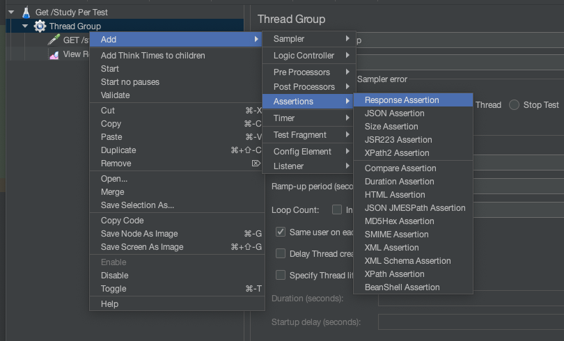

# JMeter Usage

> JMeter 의 사용방법에 대한 기록

## 주의 사항

> JMeter와 Application 서버는 분리해서 사용해야 한다.
> 이유는 `nGrinder`때와 마찬가지 이지만, `JMeter`역시나 서버의 자원을 사용하는 것이기 때문에 요청을 늘리게 될 경우 `Application`이 사용해야 할 Resource를 같이 사용하는 것이기 때문에 성능이 나쁘게 나올 수 밖에 없다.

## Project의 단위?

> TestPaln(비커모양?)이 한개의 Project의 TestPlan단위이다.

## Test Plan 작성 순서

> 위에서부터 순차로 진행하면 된다.

### TestPlan의 명칭 지정

> 다음의 `Name`이 TestPlan의 명칭설정 하는 곳이다.
>
> > 

### Thread Group 생성

> `Test Plan`을 클릭후 우클릭 하면 하위의 창이 출력된다.
>
> > 

### ThreadGroup UI설정

> Thread Group을 생성해서 UI의 설정은 아래의 설명과 같으며, 아래의 이미지를 바탕으로 해석하면 `10명의 사용자를 5초간 생성하며, 2번 반복`하는 뜻이다.
>
> > 

#### Action to be taken after a Sampler error

> Sampler가 에러가 발생시 어떻게 할것인지에 대한 설정

### Sampler의 추가

> `Thread Group`에서 우클릭을 하게 될 경우 다음과 같은 화면을 출력 할 수 있다.
> 난 웹개발자니까~ HTTP Request로~
>
> > 

### HTTP Rqeuest Sampler 설정

> 유저의 요청만 보내는것.. 응답은 Listener에서

- Protocol
  - Http, Https 설정
- Server Name or IP
  - Application이 실행중인 도메인 또는 IP
- PortNumber
  - 80,443, 8080등 application 실행 포트
- HttpMethod, MappingPath, encoding 설정
- Parameter, Body Data, FilesUpload 등은 맨 하위 칸에서 가능하다

### Listener추가

> `Thread Group`에서 우클릭을 하게 될 경우 Listener 를 추가가 가능하다.
> 강의의 경우에는 `View Results`, `View Results in Table`, `Summary Report`, `Aggregate Report`, `Response Time Graph`
> 이후 Test Plan을 실행할 경우 Result가 각각의 Listener로 추가된다.
>
> > 

## Listener 모습

### View Results Tree

> 다음과 같이 Result를 Detail하게 확인이 가능하다
>
> > 

### View Results in Table

> Sample Time 의 경우 요청 시간을 의미하며, 다음과 같이 결과가 기록된다
>
> > 

### Summary Report

> 종합적인 정보를 확인이 가능하다. 평균 요청 응답 시간, 최소 요청 응답 시간. 최대 요청 응답시간, 표준 편차 응답시간(Std.dev), Error(에러 비율), Throughput(처리시간)
>
> > 

### Aggregate Report

> Average(평균시간), Median(가운데 있는 결과값),N% Line(N%의 요청이 응답받는데 걸린 시간)
>
> > 

### Response Time Graph

> Interval의 경우 몇 ms단위로 그릴지를 확인 할 수 있는 기능이다.
>
> > Configuration 모습
> >
> > > 
> >
> > Graph Response 모습
> >
> > > 

## Assertions

### Assertions?

> Assertions의 경우에는 판단 결과가 복잡한 경우 활용 할 수 있다.
>
> > 추가는 `Thread Group`에서 우클릭 할 경우 추가가 가능하며, 추가 모습은 아래의 사진과 같다.  
> > 

### Response Assertion

> 가장 간단히 검증할 수 있는 Assertion
>
> > Response Code, Request Headers, Response Message, Response Header등 각각의 검증 방법들의 선택이 가능하다.
> >
> > > 

### JSON Assertion

> JSON Message를 검증 가능한 Assertion
>
> > JUnit의 `MockMvc`를 활용시 `.andExpect`의 jsonPath 검증 방법과 유사하게 사용하면 된다.
> >
> > > 

### Assertion Result

> Results에서 다음과 같이 확인이 가능하다
> 

## CLI를 통한 Test

1. TestPlan 작성
2. 해당 TestPlan의 `.jmx`가 있는 경로로 이동
3. 실행한 JMeter의 Path -n -t ./jmxFile.jmx
   1. `/Users/{userName}/util/JMeter/apache-jmeter-5.6.2/bin/jmeter -n -t ./Study\ Per\ Test.jmx` 의 문구가 완료된다.
      1. `-n`은 UI의 사용을 안하겠다
      2. `-t` 해당 파일의 JMeter Test에 대한 설정을 가지고 실행하는 의미

### Result

```zsh
summary +      1 in 00:00:00 =    8.1/s Avg:    65 Min:    65 Max:    65 Err:     0 (0.00%) Active: 1 Started: 1 Finished: 0
summary +  46699 in 00:00:27 = 1713.4/s Avg:    15 Min:     2 Max:   177 Err:     0 (0.00%) Active: 30 Started: 30 Finished: 0
summary =  46700 in 00:00:27 = 1705.5/s Avg:    15 Min:     2 Max:   177 Err:     0 (0.00%)
summary +  47290 in 00:00:30 = 1576.5/s Avg:    18 Min:     2 Max:   365 Err:     0 (0.00%) Active: 30 Started: 30 Finished: 0
summary =  93990 in 00:00:57 = 1638.0/s Avg:    17 Min:     2 Max:   365 Err:     0 (0.00%)
```

> 해석하면 아래와 같다.

- `46699 in 00:00:27`은 27초동안 46699번 Request를 보냄
- `= 1713.4/s` 초당 1713.4번의 요청을 처리함
- `Avg:    15 Min:     2 Max:   177 Err:     0`
  - 평균 15ms, 최소 2ms, 최대 177ms, 에러 0건

> 추가적으로 두가지의 합계가 출력되는데 다음과 같다.

- `summary +  46699 in 00:00:27`, `summary +  47290 in 00:00:30`
  - 27초간 보낸 Request 횟수, 30초간 보낸 Request 횟수
- `summary =  46700 in 00:00:27`, `summary =  93990 in 00:00:57`
  - 27초까지의 Request 총합, 57초까지의 Request 총합
