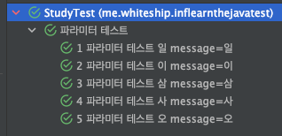
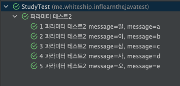

# TestCase의 반복 실행

> 해당 목차는 반복해서 TestCase를 실행해볼 필요가 존재하는 경우 활용하면 유용하다.

## 테스트를 N회만 돌려보면 되는 경우

> 별다른 인자를 받지 않고, 실제 N회의 테스트 실행이 필요한 경우 `@RepeatedTest`의 활용을 통해 가능하다

```java
@RepeatedTest(10)
void repeat_test() {
  //TestLogic
}
```

### 테스트를 N회 돌리면서 N회 실행중이라는 정보가 필요한 경우

> `RepetitionInfo`의 경우 `getCurrentRepetition()`,`getTotalRepetitions()`메소드만 존재하며,
> **현재 몇 회째의 TestCase를 진행중**인지, **총 몇회의 Test**를 진행해야하는 지 정보를 취득할 수 있다.

```java
@RepeatedTest(10)
void repeat_test(RepetitionInfo repetitionInfo) {
  System.out.println(
      "test : " +
      repetitionInfo.getCurrentRepetition() + " / " +
      repetitionInfo.getTotalRepetitions());
}
```

### `RepeatedTest`의 Display명칭 변경

> 하위 코드는 `RepeatedTest`의 구현된 코드이다. name에 default가 선언되어 있어서 설정된 값으로 나오게 되나, `name`값을 지정하면 변경이 된다.
> `@DisplayName`을 지정한다고 해도 `repetition`으로 출력이 된다.. 상위 테마가 DisplayName으로 출력되는 것일 뿐...

```java
public @interface RepeatedTest {
  String DISPLAY_NAME_PLACEHOLDER = "{displayName}";
  String CURRENT_REPETITION_PLACEHOLDER = "{currentRepetition}";
  String TOTAL_REPETITIONS_PLACEHOLDER = "{totalRepetitions}";
  String SHORT_DISPLAY_NAME = "repetition {currentRepetition} of {totalRepetitions}";
  String LONG_DISPLAY_NAME = "{displayName} :: repetition {currentRepetition} of {totalRepetitions}";

  int value();

  String name() default "repetition {currentRepetition} of {totalRepetitions}";
}
```

#### TestCase 참고 코드

```java
@DisplayName("테스트")
@RepeatedTest(10)
void repeat_test(RepetitionInfo repetitionInfo) {
  //Test Logic
}
@DisplayName("테스트")
@RepeatedTest(value=10, name="{displayName}, {currentRepetition} / {totalRepetitions}")
void repeat_test2(RepetitionInfo repetitionInfo) {
  //Test Logic
}
```

## 여러개의 값, 배열을 통해가지고 테스트를 하는 경우

> 여러가지 다양한 값을 가지고 테스트를 진행하고 싶은 경우 `@ParameterizedTest`와 `@ValueSource` 통해서 테스팅이 가능하다.

### Docs

- https://junit.org/junit5/docs/current/user-guide/#writing-tests-parameterized-tests

### 테스트 DisplayName 변경 방법

> `@DisplayName`의 경우 `@RepeatedTest`와 동일하게 횟수의 상위묶음으로 표기가 된다.
> 하지만 반복하는 테스트 명칭에 대한 수정방법은 아래의 [예제](#name-value-example)와 같으며,
> `@ParamterizedTest`의 name속성을 수정하면 된다.

| Format        | Description                                                       |
| ------------- | ----------------------------------------------------------------- |
| {index}       | 테스트 케이스 실행 횟수                                           |
| {displayName} | `@DisplayName`에 설정한 Value                                     |
| {arguments}   | `@ValueSource`에 선언한 ParameterValue                            |
| {0}, {1}      | {arguments}처럼 Parameter를 출력하며, 복수개인 경우 활용 가능하다 |

#### `@ParameterizedTest`의 Code

> 기본적으로 ParameterizedTest의 경우에는 `[Index] arguments`로 테스트 DisplayName이 출력된며, Default에서 그렇게 선언되어 있기 때문이다.

```java
public @interface ParameterizedTest {
  @API(status = Status.EXPERIMENTAL,since = "5.3")
  String DISPLAY_NAME_PLACEHOLDER = "{displayName}";
  @API(status = Status.EXPERIMENTAL,since = "5.3")
  String INDEX_PLACEHOLDER = "{index}";
  @API(status = Status.EXPERIMENTAL,since = "5.3")
  String ARGUMENTS_PLACEHOLDER = "{arguments}";
  @API(status = Status.EXPERIMENTAL,since = "5.3")
  String DEFAULT_DISPLAY_NAME = "[{index}] {arguments}";

  String name() default "[{index}] {arguments}";
}
```

#### Name Value Example

##### 단수개의 Param Sample Code

```java
@DisplayName("파라미터 테스트")
@ParameterizedTest(name = "{index} {displayName} {arguments} message={0}")
@ValueSource(strings = {"일", "이", "삼", "사", "오"})
void param_test(String str) {
  System.out.println(str);
}
```



##### 복수개의 Param Sample Code

```java
@DisplayName("파라미터 테스트2")
@ParameterizedTest(name = "{index} {displayName} message={0}, message={1}")
@MethodSource("provideParams")
void param_test(String str, char c) {
  System.out.println(str + " " + c);
}

private static Stream<Arguments> provideParams() {
  return Stream.of(
    Arguments.of("일", 'a'),
    Arguments.of("이", 'b'),
    Arguments.of("삼", 'c'),
    Arguments.of("사", 'd'),
    Arguments.of("오", 'e')
  );
}
```



### 인자값 Source

> TestCase에 Argumets를 전달하는 방법들

- [@ValueSource](#valuesource)
- [@NullSource](#nullsource)
- [@EmptySource](#emptysource)
- [@NullAndEmptySource](#nullandemptysource)
- [@MethodSource](#methodsource)

#### `@ValueSource`

> 모든 `PremitiveType`와 `Object`를 **배열 인자**로 제공이 가능하다

```java
public @interface ValueSource {
  short[] shorts() default {};
  byte[] bytes() default {};
  int[] ints() default {};
  long[] longs() default {};
  float[] floats() default {};
  double[] doubles() default {};
  char[] chars() default {};
  boolean[] booleans() default {};
  String[] strings() default {};
  Class<?>[] classes() default {};
}
```

#### `@NullSource`

> `Null`이 들어간 인자를 TestCase에 추가 제공한다.

#### `@EmptySource`

> `Empty("")`인자를 TestCase에 추가 제공 한다.

#### `@NullAndEmptySource`

> `@NullSource`와 `@EmptySource`를 동시에 제공하는 **Composed-Annotation**이다

#### `@MethodSource`

> 실행된 `Method`의 Return값을 인자로 제공한다.

#### `CsvSource`

> 복수개의 인자를 쉽게 전달 할 때

##### `CsvSource` Example Code

```java
@DisplayName("파라미터 테스트")
@ParameterizedTest(name = "{index} {displayName} {arguments} message={0} message={1}")
@CsvSource({"10, 'ABC'", "20, 'DEF'"})
void param_test(Integer a, String b) {
  System.out.println(a + " " + b);
}
```

#### 인자값의 형변환

> 주의 사항으로 `Converter`클래스를 구현하는 구현체 클래스의 경우에는 `Public`클래스 이거나 `Static Inner Class`로 구현을 해야 한다.

##### 암묵적인 타입 변환

> 문자열이 오더라도 변환해주는 타입을 의미한다

- https://junit.org/junit5/docs/current/user-guide/#writing-tests-parameterized-tests-argument-conversion-implicit

##### Custom(VO, DTO등)한 객체로 타입 변환을 하고 싶은 경우 (1개의 인자)

- `SimpleArgumentConverter`를 상속 받은 구현체를 만들어서 사용하면 된다.
  - 주의사항으로는 **한개의 Arguments**를 받을 때만 사용하는 방법이다.
- `@ConvertWith(class)`를 통해서 `SimpleArgumentConverter`의 구현체를 지정하면 된다.

```java
@DisplayName("파라미터 테스트")
@ParameterizedTest(name = "{index} {displayName} {arguments} message={0}")
@ValueSource(ints={10, 20, 30, 40, 50})
void param_test(@ConvertWith(StudyConverter.class) Study study) {
  System.out.println(study.getLimit());
}

static class StudyConverter extends SimpleArgumentConverter {
  // o는 인자값, aClass는 생성 Class Type
  @Override
  protected Object convert(Object o, Class<?> aClass) throws ArgumentConversionException {
    assertEquals(Study.class, aClass, "Can Only Convert To Study");
    return new Study(Integer.parseInt(o.toString()));
  }
}
```

##### Custom(VO, DTO등)한 객체로 타입 변환을 하고 싶은 경우 (2개이상의 인자)

- 사용할 VO Constructor

```java
public class Study {
    private int limit;
  private String name;
  public Study( int limit, String name) {
    this.name = name;
    this.limit = limit;
  }
}
```

1. 인스턴스를 TestCase에서 직접 생성

```java
@DisplayName("파라미터 테스트")
@ParameterizedTest(name = "{index} {displayName} {arguments} message={0} message={1}")
@CsvSource({"10, 'ABC'", "20, 'DEF'"})
void param_test(Integer limit, String name) {
  Study study = new Study(limit, name);
  System.out.println(study.getLimit()+ " "+study.getName());
}
```

2. `ArgumentsAccessor`를 활용할 경우

```java
@DisplayName("파라미터 테스트")
@ParameterizedTest(name = "{index} {displayName} {arguments} message={0} message={1}")
@CsvSource({"10, 'ABC'", "20, 'DEF'"})
void param_test3(ArgumentsAccessor argumentsAccessor) {
  Study study = new Study(argumentsAccessor.getInteger(0),argumentsAccessor.getString(1));
  System.out.println(study.getLimit()+ " "+study.getName());
}
```

3. `ArgumentsAggregator` Interface 구현과 `@AggregateWith(구현체.class)`활용

```java
@DisplayName("파라미터 테스트")
@ParameterizedTest(name = "{index} {displayName} {arguments} message={0} message={1}")
@CsvSource({"10, 'ABC'", "20, 'DEF'"})
void param_test3(@AggregateWith(StudyAggregator.class) Study study) {
  System.out.println(study.getLimit()+ " "+study.getName());
}

static class StudyAggregator implements ArgumentsAggregator {
  @Override
  public Object aggregateArguments(ArgumentsAccessor argumentsAccessor, ParameterContext parameterContext) throws
    ArgumentsAggregationException {
    return new Study(argumentsAccessor.getInteger(0), argumentsAccessor.getString(1));
  }
}
```
