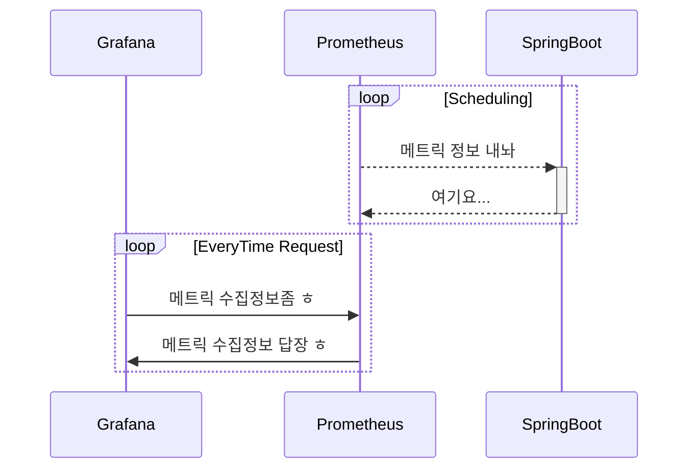
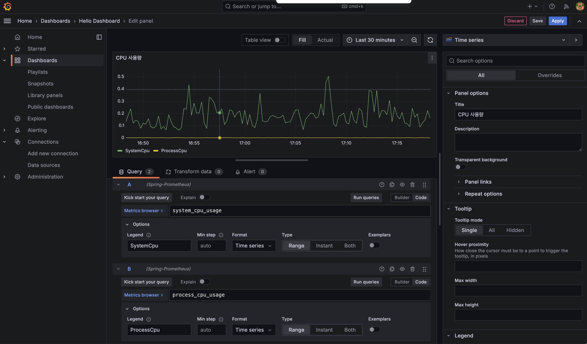
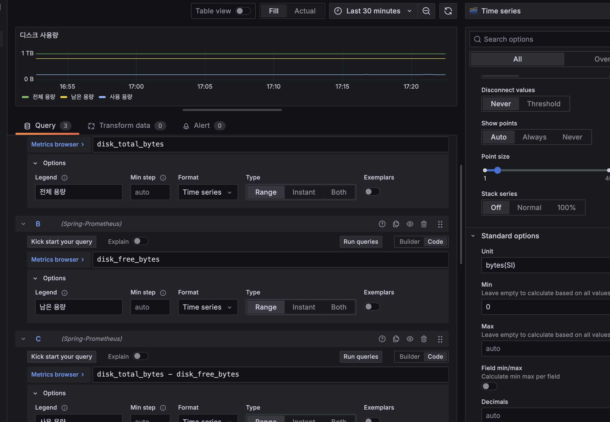
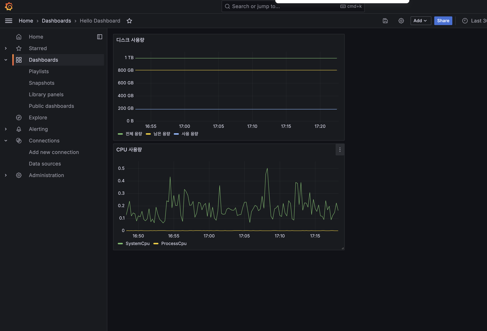
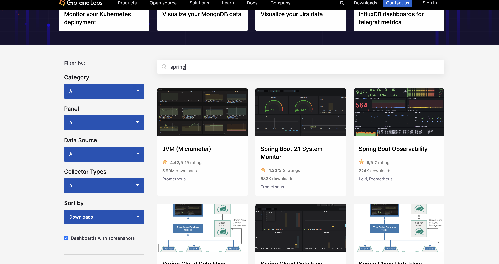

# README

## Actuator

### 엔드포인트 설정

> 엔드포인트를 사용시에는 2가지 과정이 필요하다
>
> > 1. 엔드포인트 활성화
> > 2. 엔드포인트 노출

> [!NOTE]  
> **엔드포인트를 활성화** 한다는 것은 해당 기능 자체를 사용할지 말지 `on`, `off` 하는것을 의미한다.
> **엔드포인트를 노출**한다는 것을 활성화된 엔드포인트를 HTTP에 노출할지 JMX에 노출할지 선택하는 것.
> 엔드포인트를 활성화하고 추가로 HTTP를 통해서 웹에 노출할지, JMX를 통해서 노출할지 두위치 모두 노출할지 지정해 줘야한다.

### 자주 사용하는 엔드포인트의 목록

> [!NOTE] > `/actuator`는 전제츨 확인가능하다
> `/actuator/{아래의 엔드포인트 목록}` 을 입력시 해당 항목만 확인이 가능하다.

- `beans` : 스프링 컨테이너에 등록된 스프링 빈을 보여준다.
- `conditions` : `condition` 을 통해서 빈을 등록할 때 평가 조건과 일치하거나 일치하지 않는 이유를 표시한다.
- `configprops` : `@ConfigurationProperties` 를 보여준다.
- `env` : `Environment` 정보를 보여준다.
- `health` : 애플리케이션 헬스 정보를 보여준다.
- `httpexchanges` : HTTP 호출 응답 정보를 보여준다. `HttpExchangeRepository` 를 구현한 빈을 별도로 등록해야 한다.
- `info` : 애플리케이션 정보를 보여준다.
- `loggers` : 애플리케이션 로거 설정을 보여주고 변경도 할 수 있다.
- `metrics` : 애플리케이션의 메트릭 정보를 보여준다.
- `mappings` : `@RequestMapping` 정보를 보여준다.
- `threaddump` : 쓰레드 덤프를 실행해서 보여준다.
- `shutdown` : 애플리케이션을 종료한다. 이 기능은 **기본으로 비활성화** 되어 있다.

> [!NOTE]
>
> **전체 엔드포인트는 다음 공식 메뉴얼을 참고하자.**  
> https://docs.spring.io/spring-boot/docs/current/reference/html/actuator.html#actuator.endpoints

### 헬스정보

> [!NOTE]  
> 헬스 정보를 사용하면 어플리케이션에 문제가 발생시 문제를 빠르게 인지가 가능하며 엔드포인트는 `/actuator/health`이다.
>
> 헬스정보는 단순히 어플리케이션이 요청에 응답할 수 있는지를 판단하는 것을 넘어 어플리케이션이 사용하는 DB가 응답중인디, 디스크 사용량에 문제는 없는지 등 다양한 정보를 함께 포함해서 만들어진다.

#### 헬스 설정

> [!NOTE]
> 엑츄에이터는 `db`, `mongo`, `redis`, `diskspace`, `ping`과 같이 수많은 헬스 기능이 기본 제공되며,하나라도 Down인경우 종합 Status는 Down으로 표기된다.

- 공식 메뉴얼 :
  - https://docs.spring.io/spring-boot/docs/current/reference/html/actuator.html#actuator.endpoints.health.auto-configured-health-indicators
- 커스텀 헬스정보 추가 메뉴얼 :
  - https://docs.spring.io/spring-boot/docs/current/reference/html/actuator.html#actuator.endpoints.health.writing-custom-health-indicators

```yaml
management:
  endpoint:
    shutdown:
    health:
      #   헬스정보를 세부적으로 확인하고 싶은 경우
      show-details: always
      # 헬스정보를 컴포넌트별로 상태만 확인하고 싶은 경우
      show-components: always
```

### 어플리케이션 정보

> [!NOTE]
>
> `info` 엔드포인트는 어플리케이션의 기본 정보를 노출하며, `/actuator/info`가 엔드포인트 이다.

- 기본제공 기능
  - `java`: 자바 런타임정보
  - `os` : OS 정보
  - `env` : `Environment` 에서 `info.` 로 시작하는 정보
  - `build` : 빌드 정보, `META-INF/build-info.properties` 파일이 필요하다.
  - `git` : `git` 정보, `git.properties` 파일이 필요하다.
- `env` , `java` , `os` 는 기본으로 비활성화 되어 있다.

#### `java`, `os`활성화 설정

```yaml
management:
  info:
    java:
      enabled: true
    os:
      enabled: true
```

#### `env`설정

다음과 같이 설정하면, info로 들어가게 될 경우, app하위의 정보를 확인가능하다

```yaml
management:
  info:
    env:
      enabled: true
info:
  app:
    name: hello-actuator
    company: yh
```

#### Build정보 설정

> [!NOTE]  
> 빌드정보를 확인하고 싶은경우, `build.gradle`에 아래의 작업을 추가만 하면 된다.
> 이렇게 하고 빌드를 해보면 `build` 폴더안에 `resources/main/META-INF/build-info.properties` 파일 을 확인할 수 있다.

```groovy

springBoot{
    buildInfo()
}

```

#### git설정

> [!WARNING]
> 먼저 우선순위는 깃이 프로젝트로 관리가 되야한다.

> [!NOTE]  
> 깃 확인하고 싶은경우, `build.gradle`에 플러그인을 추가하면 끝이다.

```groovy
plugins {
    id "com.gorylenko.gradle-git-properties" version "2.4.1" //git info
}
```

세부적인 항목을 더 추가로 보고싶은경우 아래의 설정을 추가하면된다.

```yaml
management:
  info:
    git:
      mode: full
```

### 로거설정

> Logger의 엔드포인트는 `/actuator/loggers`이며, 각각의 패키지들이 어떠한 로그레벨을 가지고 있는지를 확인할 때 사용하며, 모든 엔드포인트를 개방해 두었다면 따로 설정할 부분은 없다.

#### 서버 운영중 로그레벨변경이 필요한 경우

> `jong1.controller` 패키지경로가 존재한다고 할 경우를 가정시
> 아래처럼 Request를 발송하게 될 경우 운영상황이 유지가 되면서 로거레벨이`DEBUG`레벨로 변경이 된다

```curl
POST {Host}/actuator/loggers/jong1.controller

JSON
{
  "configuredLevel" : "DEBUG"
}
```

### HTTP 요청 응답 기록(HttpExcanges)

> [!NOTE]
> HTTP 요청과 응답의 과거 기록을 확인하고 싶은 경우에는 `httpexchanges`엔드포인트를 활용하면 된다.

#### 설정방법

> [!NOTE]  
> `httpexchanges`는 인터페이스 구현체를 빈으로 등록을하여 엔드포인트를 사용할 수 있으며, 빈을 등록하지 않는 경우 엔드포인트가 활성화가 되지않는다.
>
> > 스프링 부트는 기본으로 `InMemoryHttpExchangeRepository`구현체를 제공한다.

```java
// 다음과 같이 빈을 추가해야한다.
@Bean
public InMemoryHttpExchangeRepository httpExchangeRepository() {
    return new InMemoryHttpExchangeRepository();
}
```

### Actuator의 보안

#### Actuator의 포트번호 변경방법

```yaml
management:
  server:
    port: 9999
```

#### Actuator의 엔드포인트 변경법

> `/actuator/{}`에서 `/manage/{}`로 변경된다.

```yaml
management:
  endpoints:
    web:
      base-path: "/manage"
```

#### 포트를 변경하지 못하는 상황

> [!NOTE]
> Actuatordml URL경로에 인증을 추가한다.
> `/actuator`패스에 서블릿 필터, 인터셉터, 시큐리티등을 설정하고 인증된 사용자만 접근하도록 추가개발을 해야 함.

---

## 모니터링

### 마이크로미터란?

> [!NOTE]  
> 개발자가 모니터링 툴을 확인할 때, JMX를 사용할 수도, 그라파나 등의 다양한 툴을 사용할 수도 있는데, 변경할떄마다 요청되는 형식이 다르다.
> 이걸 간편하게 사용할 수 있도록 추상화를 해둔것을 `마이크로미터`라고 하며, 마이크로미터를 구현한 구현체들이 각 툴들에 맞게 구현을 완료해놓고, 개발자는 마이크로미터만 활용을 하면 된다.

### 메트릭

> [!NOTE]
> 지표를 확인하는 엔드포인트로 `{HostName}/actuator/metric`이다.
> 들어가게 되면 names하위로 다양한 지표 항목들이 출력이 되며, 단일로 확인하고 싶은 경우 `{HostName}/actuator/metric/{names항목명}` 으로 세부 확인이 가능하다.

#### JVM메트릭

> JVM과 관련된 메트릭을 제공하며, `jvm.`으로 시작한다

- 메모리 및 버퍼 풀 세부 정보
- 가비지 수집 관련 통계
- 스레드 활용내역
- 로드 및 언로드된 클래스의 갯수
- JVM의 버전정보
- JIT 컴파일 시간 등

#### 시스템 메트릭

> 시스템과 관련된 메트릭을 제공하며, `system.`, `process.`, `disk.`으로 시작한다.

- CPU지표
- 파일 디스크립터 메트릭
- 가동시간 관련 메트릭
- 사용가능한 디스크 공간 등등

#### 에플리케이션 메트릭

> 어플리케이션과 관련된 메트릭을 제공하며, `application.`으로 시작한다. 어플리케이션 시작시간, 요청 처리 준비 시간등이 있다.

#### 스프링 MVC 매트릭

> 스프링 MVC컨트롤러가 처리하는 모든 요청을 다루는 메트릭이며, `http.server.requests`로 시작한다.

- `TAG`를 사용해서 다음 정보를 분류해 확인이 가능하다.
  - `uri`: 요청된 URI
  - `method`: `GET`, `POST`, `PUT`과 같이 요청되는 HTTP메서드
  - `status`: `200`, `404`, `500`등 Server에서 반환하는 Http Status코드
  - `exception`: 발생된 예외
  - `outcome`: 상태코드를 그룹으로 모아서 확인이 가능하다.
    - `1xx:INFORMATIONAL` tag=outcome:INFORMATIONAL
    - `2xx:SUCCESS` tag=outcome:SUCCESS
    - `3xx:REDIRECTION` tag=outcome:REDIRECTION
    - `4xx:CLIENT_ERROR` tag=outcome:CLIENT_ERROR
    - `5xx:SERVER_ERROR` tag=outcome:SERVER_ERROR

#### 데이터소스 메트릭

> `DataSource` 커넥션 풀에 관련한 정보를 확인 가능한 메트릭이며, `jdbc.connection`으로 시작하며, 히카리CP를 사용하면 `hikaricp.`를 통해서 더 자세한 커넥션 상황 확인이 가능하다

- 최대 커넥션
- 최소 커넥션
- 활성 커넥션
- 대기 커넥션등등

#### 로그 메트릭

> logback로그에서 로그 레벨별로 발생된 갯수 정보를 확인하는 메트릭이며, `logback.events`이다.
>
> `logback.events?tag=level:error`
>
> > `tag`는 `trace`, `debug`, `info`, `warn`, `error`이다

#### 톰캣 메트릭

> 톰캣 메트릭은 톰캣정보에서 관리하는 정보를을 확인가능한 메트릭이며, `tomcat.`으로 시작한다

- 톰캣 캐시
- 톰캣 연결 커넥션
- 글로벌
- 서블릿
- 세션
- 스레드

##### 필요한 추가 설정

> 톰캣 메트릭은 최초에는 session과 관련된 부분밖에 사용이 불가능하며, 아래와 같이 설정할 경우 톰캣의 `servlet`, `global`, `connection`, `cache`, `thread` 등 다양한 정보확인이 가능하기에 켜두는것을 권장한다

```yaml
server:
  tomcat:
    mbeanregistry:
      enabled: true
```

#### 그외

- 스케쥴링
- 캐시
- HTTP 클라이언트 메트릭
- 레디스 메트릭
- 스프링 데이터 리포지토리 메트릭
- 개발자 가 직접 정의한 메트릭 등 등록이 가능하다

##### 직접 정의한 메트릭?

예시는 주문수, 취소수 등 직접 개발한 메트릭을 의미한다.

### 프로메테우스와 그라파나란?

#### 프로메테우스란

> [!NOTE]  
> **애플리케이션에서 발생한 메트릭을 그 순간만 확인하는 것이 아니라 과거 이력까지 함께 확인**하려한다면 `보관하는 DB와, 메트릭을 지속해서 수집하고 DB에 저장해야하는 프로그램`이 필요하다.
> 해당 역할을 담당하는 프로그램이 프로메테우스이다.

#### 그라파나란

> [!NOTE] > `프로메테우스가 수집한 데이터를 불러서 사용자가 보기 편하게 보여주는 대시보드`이며, 그라파나는 매우 유연하고, 그래프로 보기 쉽게 보여주는 툴이며, 수많은 그래프를 제공하며 프로메테우스를 포함한 다른 데이터소스도 지원한다.

## 프로메테우스

### 설치

> [!WARN]  
> 도커로 설치는 가능하나, 예제를 따라해야하니.. 직접 설치하자  
> `Mac`의 경우 링크에서 `darwin`을 다운로드 받는다

- 다운로드 링크
  - https://prometheus.io/download/

### 프로메테우스 실행

1. 다운로드 파일의 압출을 해제한다.
2. 터미널을 통해 압출해제한 경로로 이동한다
3. 터미널에서 `./prometheus`를 실행한다
4. 맥북의 시스템 -> 개인정보 보호 및 보안 -> 하단의 보안 -> prometheus 권한 허용을 한다
5. 터미널에서 `./prometheus`를 재실행한다.
6. `http://localhost:9090`으로 접속하면 실행여부의 확인이 가능하다.

### SpringBoot에서 프로메테우스 마이크로미터 설정

> `build.gradle`에 의존성을 추가한다. 그러면 `/actuator/prometheus`다음의 엔드포인트가 자동으로 추가되고, 현재의 메트릭정보를 프로메테우스에 맞게 포매팅하여 반환한다.

```groovy
implementation 'io.micrometer:micrometer-registry-prometheus'
```

### 프로메테우스에서의 설정

> [!NOTE]  
> 프로메테우스를 설치한 패스에 `prometheus.yml`파일이 존재하며, 해당파일의 수정이 필요하다.
> `scrape_configs` 속성에 아래처럼 추가하면 된다. 기존의 항목은 내비둔다(삭제해도 상관은 없다).
>
> 아래의 설정을 한 이후, 프로메테우스를 재실행 한뒤 status -> configuration에서 yml이 적용된것을 확인하고, target에서 정상적으로 수집중인지를 확인하면 된다.

```yaml
scrape_configs:
  - job_name: "spring-actuator"      그라파나에 표시될 잡네임
    metrics_path: "/actuator/prometheus"  백엔드에서 반환하는 엔드포인트
    scrape_interval: 1s             스크랩주기 (보통 10~15s를 주기로 잡음, 기본값은 1m)
    static_configs:
      - targets: ["localhost:8080"] 연결할 서버정보들
```

## 그라파나

### 설치

> [!WARN]  
> 도커로 설치는 가능하나, 예제를 따라해야하니.. 직접 설치하자

- 다운로드 링크
  - https://grafana.com/grafana/download 에서 가능하다
    - https://dl.grafana.com/enterprise/release/grafana-enterprise-10.4.0.darwin-amd64.tar.gz
    - 터미널
      ```bash
      curl -O https://dl.grafana.com/enterprise/release/grafana-enterprise-10.4.0.darwin-amd64.tar.gz
      tar -zxvf grafana-enterprise-10.4.0.darwin-amd64.tar.gz
      ```

### 그라파나 실행

1. 다운로드 및 압축 해제
2. 터미널에서 해제한 디렉토리로 이동
3. `bin`디렉토리로 이동
4. `./grafana-server`를 실행한다
5. 맥북의 시스템 -> 개인정보 보호 및 보안 -> 하단의 보안 -> grafana의 권한 허용을 한다
6. 터미널에서 `./prometheus`를 재실행한다.
7. `http://localhost:3000`에서 접속
   1. id, pwd는 `admin`을 입력한다
   2. 새계정 만드는건 스킵

### 그라파나 프로메테우스 연동

1. 그라파나 페이지 접속
2. Connections 접속
3. Add new Connections에서 Prometheus 클릭
4. Add new DataSource 클릭
5. Connection에 Prometheus의 주소인 localhost:9090으로 입력
   1. 타서버에서 돌리는 경우에는 값이 변경이 필요하다.
6. 하단에서 Save&Test를 클릭한다.
7. Connections -> Data sources를 확인시 확인이 가능

### 대시보드를 제작하는 과정

#### 주의사항

> [!WARN]
> 아래의 관계도로 인하여, 어플리케이션, 프로메테우스, 그라파나는 모두 켜져있어야 한다.



#### 생성방법

1. 그라파나 페이지의 Dashboard접근
2. 우상단의 New dashboard 클릭 및 Save Dashboard
3. DashBoard탭으로 다시 돌아가서 생성이 되었는지 확인후, 다시 해당 대시보드를 클릭한다
4. Add Visualization -> Prometheus 데이터소스 선택
5. 하단에 쿼리부분에서 빌더와 코드로 공식 생성이 가능하다.
   1. 예제에서는 코드로 작성
6. 프로메테우스의 쿼리를 작성
   1. 여러개의 데이터를 같이 출력하고 싶은 경우, Add Query를 통해 추가하면 된다.

#### 패널생성이미지

- 패널생성방법
  
- 패널용량설정
  
- 대시보드 패널들 모습
  

#### 용어 설명

- 대시보드 : 패널들의 모음, 큰틀
- 패널 : 항목들을 표현해줄 그래프 컴포넌트

#### 이미 제작된 공유 대시보드 활용

> [!NOTE]
> 패널을 직접 만들어보니 여간힘든게 아니었다... 이미 다양한 사람들이 만들어둔 대시보드가 공개되어 있다.
> 스프링부트와 마이크로미터를 사용해 만든 대시보드를 활용해 보는 방법에 대한 기록이다.

1. 링크 접속
   1. https://grafana.com/grafana/dashboards
2. spring 검색
   1. 다음과 같이 뜨는데 JVM, SpringBoot 2.1 System Monitor가 자주 사용이 된다.
      
3. 맘에 드는 대시보드에 접속후 JSON을 다운로드 받거나 ID를 복사한다
4. Grafana의 Dashboard에서 Import Dashboard를 한다.
5. 다운로드 받은 JSON을 업로드하거나 복사한 ID를 기록후 Load한다
6. DataSource를 지정한다, (예제의 경우 Prometheus뿐이다.)
