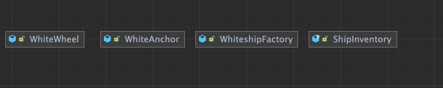
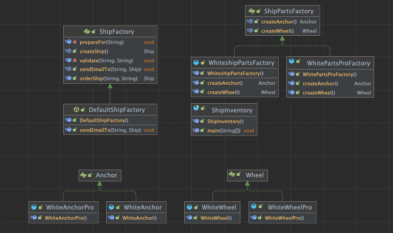

# AbstractFactory(추상 팩토리) Pattern

## Abstract Factory?

> 서로 관련있는 `여러개의 객체`를 생성해주는 인터페이스

## Factory Method와의 차이점

> `Factory Method`의 경우 주된 관점은 **객체를 생성, 구현하는 과정**에 더 집중이 되어있다.
> 반면에 `Abstract Factory`의 경우에는 `Factory Method`를 **사용하는 방법**에 더 집중이 되어있다.

### Factory의 목적

- `Factory Method`는 **구체적인 객체 생성 과정**을 **하위 또는 구체적인 클래스로 옮기는 것**이 목적이다
- `Abstract Factory`는 **여러개의 객체를 구체적인 클래스에 의존하지 않고 생성 할 수 있게 하는 것**이 목적이다.

## 이점?

> 관련있는 부분별로, 분류를 나누고 역할을 전담하게 해줌으로서 인해서 일종의 `단일 책임 원칙`을 지키면서도, `개방 폐쇄 원칙`을 가져갈 수 있다

## Source

### 주의사항

> [Factory Method Pattern](./Factory%20Method.md)에서 생성된 코드를 확장도 같이 하기 때문에 이어서 사용한다.

### Before Source

#### Before Class Diagram



#### Main

```java
public class ShipInventory {
  public static void main(String[] args) {
    ShipFactory shipFactory = new WhiteshipFactory();
    Ship ship = shipFactory.createShip();
  }
}
```

#### ShipFactory

```java
public class WhiteshipFactory extends DefaultShipFactory {
  @Override
  public Ship createShip() {
      Ship ship = new Whiteship();
      ship.setAnchor(new WhiteAnchor());
      ship.setWheel(new WhiteWheel());
      return ship;
  }
}
```

#### Anchore, Wheel

```java
public class WhiteWheel  {}
public class WhiteAnchor {}
```

### After Source

#### After Class Diagram



#### Main

```java
public class ShipInventory {
  public static void main(String[] args) {
    ShipFactory shipFactory = new WhiteshipFactory(new WhiteshipPartsFactory());
    Ship ship = shipFactory.createShip();
    System.out.println(ship.getAnchor().getClass());
    System.out.println(ship.getWheel().getClass());
  }
}
```

#### Ship Factory

```java
public class WhiteshipFactory extends DefaultShipFactory {
    private ShipPartsFactory shipPartsFactory;
    public WhiteshipFactory(ShipPartsFactory shipPartsFactory) {
        this.shipPartsFactory = shipPartsFactory;
    }

    @Override
    public Ship createShip() {
        Ship ship = new Whiteship();
        ship.setAnchor(shipPartsFactory.createAnchor());
        ship.setWheel(shipPartsFactory.createWheel());
        return ship;
    }
}

```

#### Parts Factory

> 기존에 Factory만 존재하던 코드에서, ShipFactory, PartsFactory로 분리

```java
// 해당 Interface가 Abstract Factory Interface
public interface ShipPartsFactory {
  Anchor createAnchor();
  Wheel createWheel();
}

//구현체
public class WhitePartsProFactory implements ShipPartsFactory {
  @Override
  public Anchor createAnchor() {return new WhiteAnchorPro();}
  @Override
  public Wheel createWheel() {return new WhiteWheelPro();}
}

public class WhiteshipPartsFactory implements ShipPartsFactory {
  @Override
  public Anchor createAnchor() {return new WhiteAnchor();}
  @Override
  public Wheel createWheel() {return new WhiteWheel();}
}
```

#### Anchore, Wheel

```java
public interface Wheel {}
public interface Anchor {}

public class WhiteWheel implements Wheel {}
public class WhiteWheelPro implements Wheel {}
public class WhiteAnchor implements Anchor{}
public class WhiteAnchorPro implements Anchor{}
```
