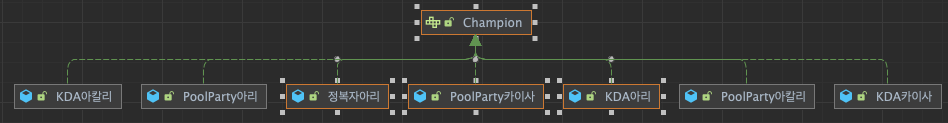
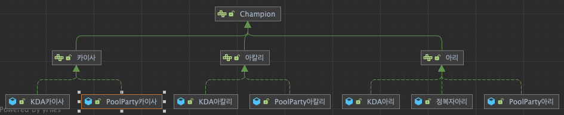
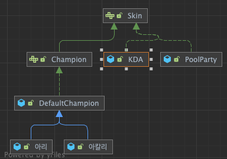

# Bridge Pattern

## Bridge?

> 구현부에서 추상층을 분리하여 각자 독립적으로 변형이 가능하고, 확장이 가능하도록 하는 패턴.  
> 기능과 구현에 대해서 두개의 별도의 클래스로 구현을 한다.

## 장단점

### 장점

- 추상적 코드와 구체코드의 변경없이 독립적 확장이 가능
- 추상코드와 구현코드 분리가 가능

### 단점

- 계층 구조의 증가로 인한 복잡도 증가

## Structure

### Before Structure

> 기능 개발전에 다음과 같이 설계 및 개발이 가능할 것이다..




### After Structure

> 하지만 스킨이 추가될 수록 Class의 수가 기하급수적으로 많아 지면서 관리가 힘들 것이다. 이걸 기능과 구현을 분리하면 다음과 같아진다.



## Source

### Before Source

> 다음과 같이 되어 있을때, 구현 클래스애서 기능과 행위가 전부 지정되어있다.

```java
public interface Champion  {
    void move();
    void skillQ();
    void skillW();
    void skillE();
    void skillR();
}

public interface 아리 extends Champion{}

public class PoolParty아리 implements 아리 {
    @Override
    public void move() {
        System.out.println("PoolParty move");
    }
    @Override
    public void skillQ() {
        System.out.println("PoolParty Q");
    }
    @Override
    public void skillW() {
        System.out.println("PoolParty W");
    }
    @Override
    public void skillE() {
        System.out.println("PoolParty E");
    }
    @Override
    public void skillR() {
        System.out.println("PoolParty R");
    }
    @Override
    public String getName() {
        return null;
    }
}
```

### After Source

```java
public interface Skin {
    String getName();
}

public class PoolParty implements Skin {
    @Override
    public String getName() {
        return "PoolParty";
    }
}

public class KDA implements Skin{
    @Override
    public String getName() {
        return "KDA";
    }
}

public interface Champion extends Skin {
    void move();
    void skillQ();
    void skillW();
    void skillE();
    void skillR();
}

public class DefaultChampion implements Champion {
    private Skin skin;
    private String name;
    public DefaultChampion(Skin skin, String name) {
        this.skin = skin;
        this.name = name;
    }

    @Override
    public void move() {
        System.out.printf("%s %s move\n", skin.getName(), this.name);
    }

    @Override
    public void skillQ() {
        System.out.printf("%s %s Q\n", skin.getName(), this.name);
    }

    @Override
    public void skillW() {
        System.out.printf("%s %s W\n", skin.getName(), this.name);
    }

    @Override
    public void skillE() {
        System.out.printf("%s %s E\n", skin.getName(), this.name);
    }

    @Override
    public void skillR() {
        System.out.printf("%s %s R\n", skin.getName(), this.name);
    }

    @Override
    public String getName() {
        return null;
    }
}

public class 아리 extends DefaultChampion {
    public 아리(Skin skin) {
        super(skin, "아리");
    }
}

```
