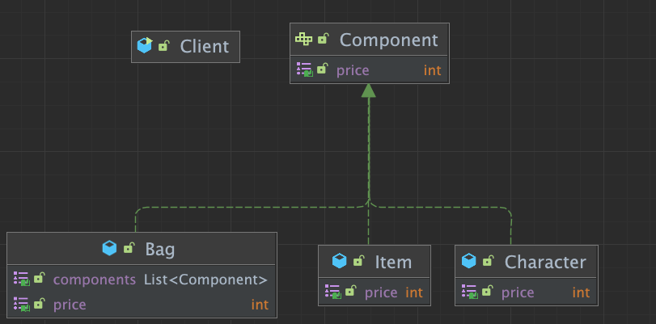

# Composit Pattern

## Composit?

> 전체의 계층 구조와 계층구조를 이루는 중간층의 구조를 클라이언트에서는 동일하게 취급할 수 있게끔 구조를 만드는 패턴
>
> 즉 최상단인지, 중단인지 최말단인지 구분없이 인터페이스를 활용해서 동일한 사용아 기능해야 하는 패턴이며, 트리구조로 제작을 해야함.

> Client 즉 사용자 입장에서는 Interface에 사용에 대한 기능을 위임

## Composit Structure

> 아래의 이미지 처럼 모두 공통의 Interface를 활용하며, 사용자는 Interface의 기능밖에 모르는 상황이 된다.



## 장단점

### 장점

- 복잡한 트리 구조를 간편하게 사용이 가능하다
- 다형성과 재귀를 활용 가능하다
- 클라이언트 코드의 변경 없이 새로운 엘리멘트 타입의 추가가 가능하다

### 단점

- 트리를 제작해야 하기 때문에 지나치게 일반화 해야하는 경우도 발생할 수 있다

## Source

### Before Source

#### Main

> 다음과 같이 Main에서 가격정보를 가져오기위해서 하위의 기능에 대해서 알아야 할 필요가 존재한다

```java
public class Client {
  public static void main(String[] args) {
    Item doranBlade = new Item("도란검", 450);
    Item healPotion = new Item("체력 물약", 50);

    Bag bag = new Bag();
    bag.add(doranBlade);
    bag.add(healPotion);

    Client client = new Client();
    client.printPrice(doranBlade);
    client.printPrice(bag);
  }

  private void printPrice(Item item) {
    System.out.println(item.getPrice());
  }

  private void printPrice(Bag bag) {
    int sum = bag.getItems().stream().mapToInt(Item::getPrice).sum();
    System.out.println(sum);
  }
}
```

#### VO

```java
//Bag
public class Bag {
  private List<Item> items = new ArrayList<>();
  public void add(Item item) {
    items.add(item);
  }
  public List<Item> getItems() {
    return items;
  }
}
//Item
public class Item {
  private String name;
  private int price;
  public Item(String name, int price) {
    this.name = name;
    this.price = price;
  }
  public int getPrice() {
    return this.price;
  }
}
```

### After Source

> 기존과 비교시 Main은 Interface의 기능만 알면 된다..

#### Main

```java
public class Client {
  public static void main(String[] args) {
    Item doranBlade = new Item("도란검", 450);
    Item healPotion = new Item("체력 물약", 50);

    Bag bag = new Bag();
    bag.add(doranBlade);
    bag.add(healPotion);

    Client client = new Client();
    client.printPrice(doranBlade);
    client.printPrice(bag);
  }

  private void printPrice(Component component) {
    System.out.println(component.getPrice());
  }
}
```

#### VO

```java
public interface Component {
  int getPrice();
}

public class Bag implements Component {
  private List<Component> components = new ArrayList<>();
  public void add(Component component) {
    components.add(component);
  }
  public List<Component> getComponents() {
    return components;
  }
  @Override
  public int getPrice() {
    return components.stream().mapToInt(Component::getPrice).sum();
  }
}

public class Character implements Component {
  private Bag bag;
  @Override
  public int getPrice() {
    return bag.getPrice();
  }
}

public class Item implements Component {
  private String name;
  private int price;

  public Item(String name, int price) {
    this.name = name;
    this.price = price;
  }

  @Override
  public int getPrice() {
    return this.price;
  }
}
```
